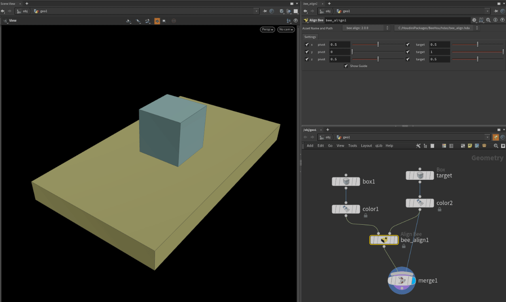
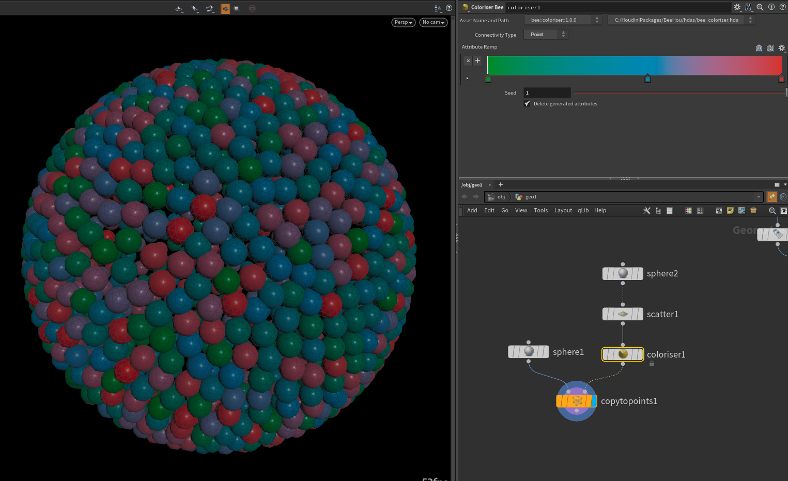
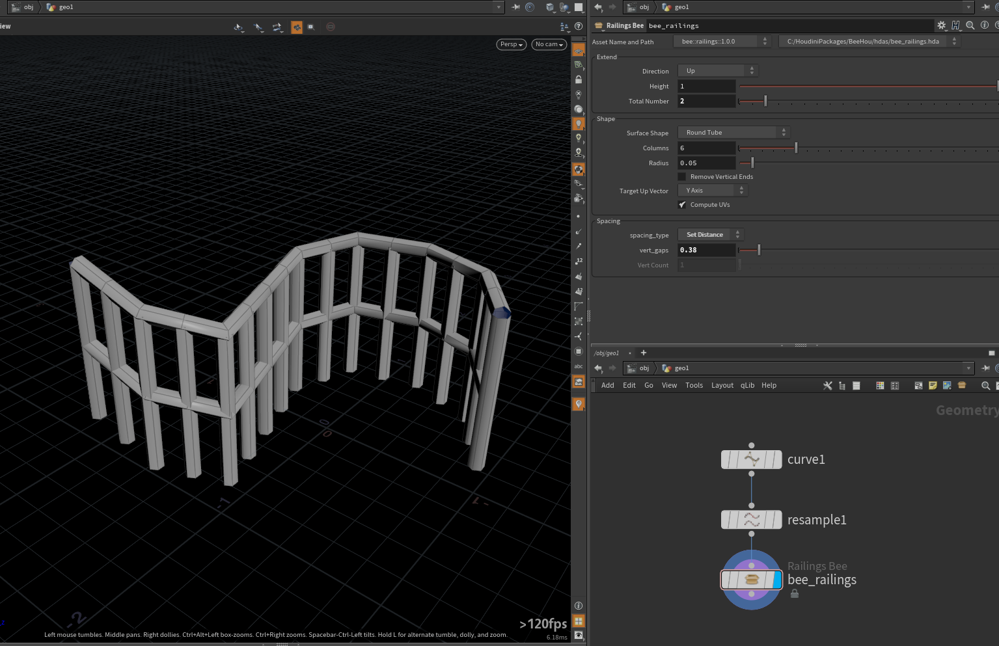
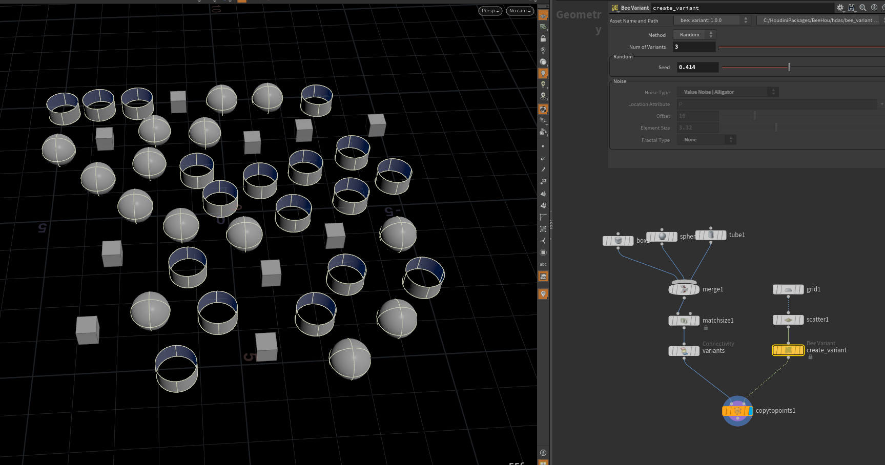

# BeeHou 🐝

Package of tools and scripts for Sidefx Houdini.

I intended to keep this package open and free and welcome feedback and suggestions! 🥂

[twitter @simonreeves3d](https://twitter.com/simonreeves3d)

[simonreeves.com](https://simonreeves.com)

## Setup
This repository is a [Houdini Package](https://www.sidefx.com/docs/houdini/ref/plugins.html) just like [qLib](https://github.com/qLab/qLib) or [SideFXLabs](https://github.com/sideeffects/SideFXLabs) and the installation is the same.

1. Clone this repository into the folder of your choosing eg. `C:/HoudiniPackages`

2. Copy the `BeeHou.json` file from the package to $HOME/Houdini[version]/packages (eg. windows default for 18.5 is `C:\Users\[youruser]\houdini18.5\packages`)

3. Create the environment variable `$HOUDINI_PACKAGE_PATH` referenced in the json to where your packages are stored eg. `C:/HoudiniPackages` 

# Tools & Features

### $JOB display
`$JOB` will display in the corner of the network view, a helpful reminder to see which environment you're in 

### Place Highlight

Object level viewer state tool to interactivly position a light by placing its highlight on geo.
My first attempt with python viewer state to replicate the #1 feature in 3dsmax 3.1

### Camera Focus
Adds a null to the selected camera(s) linked to the camera to control focus distance.

https://user-images.githubusercontent.com/12150445/212693598-f8608ce1-980c-44b9-9956-587d49cb2418.mp4

### Align
:warning: I think this is pretty much redundant since sidefx added [Match Size SOP](https://www.sidefx.com/docs/houdini/nodes/sop/matchsize.html)

Align one object by target object

I built this as to control an object's position by percentage target bounding box, to specficially allow you to place inside or outside of object

### Barndoors
Not sure I have ever used this but I thought it would be fun.
Parented to a light, creates a [barn door](https://en.wikipedia.org/wiki/Stage_lighting_accessories#Barn_doors) object for a bit more control over light casting

### Camshake
:warning: WIP

### Coloriser

SOP to quickly set color using connectivity and a gradient

### Railings

Built for creating background railings easily from generated curves - SOP to create simple railings from a curve, has various options for number if horizontals/verticals, sweep shape etc.!

## Variant
:warning: Probably just use [attribute from names](https://www.sidefx.com/docs/houdini/nodes/sop/attribfrompieces.html) :)

Very simple SOP for the common task of creating `variant` attributes on template points for `copy to points`
